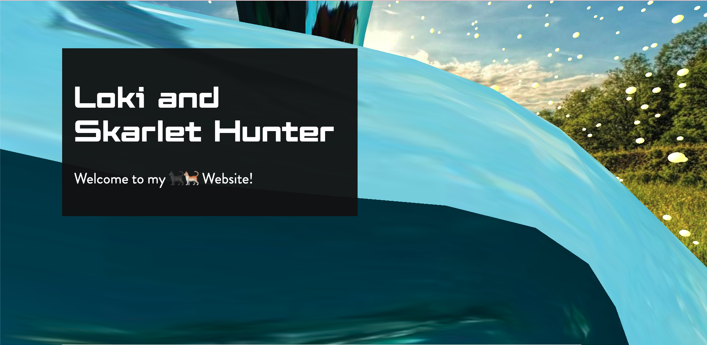
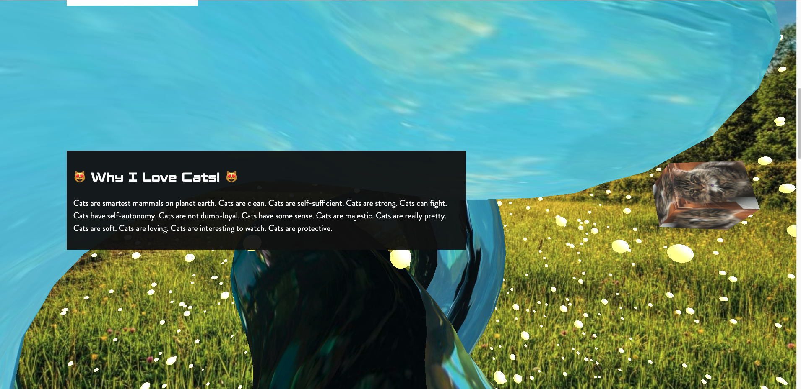
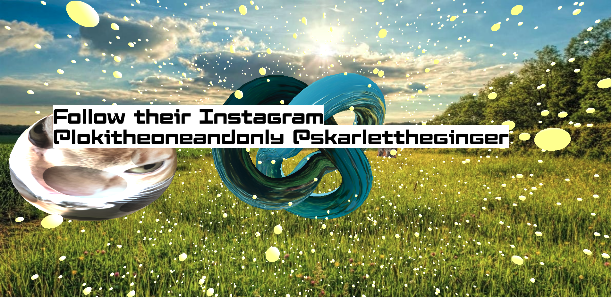

```text
                  ___           ___           ___           ___         ___          ___                                ___                       ___           ___                       ___                   
      ___        /__/\         /  /\         /  /\         /  /\       /  /\        /  /\                   ___        /__/\          ___        /  /\         /  /\        ___          /  /\                  
     /  /\       \  \:\       /  /::\       /  /:/_       /  /:/_     /  /:/       /  /:/_                 /  /\       \  \:\        /  /\      /  /::\       /  /::\      /  /\        /  /::\                 
    /  /:/        \__\:\     /  /:/\:\     /  /:/ /\     /  /:/ /\   /__/::\      /  /:/ /\               /  /:/        \  \:\      /  /:/     /  /:/\:\     /  /:/\:\    /  /:/       /  /:/\:\    ___     ___ 
   /  /:/     ___ /  /::\   /  /:/~/:/    /  /:/ /:/_   /  /:/ /:/_  \__\/\:\    /  /:/ /::\             /  /:/     ___  \  \:\    /  /:/     /  /:/  \:\   /  /:/~/:/   /__/::\      /  /:/~/::\  /__/\   /  /\
  /  /::\    /__/\  /:/\:\ /__/:/ /:/___ /__/:/ /:/ /\ /__/:/ /:/ /\    \  \:\  /__/:/ /:/\:\           /  /::\    /__/\  \__\:\  /  /::\    /__/:/ \__\:\ /__/:/ /:/___ \__\/\:\__  /__/:/ /:/\:\ \  \:\ /  /:/
 /__/:/\:\   \  \:\/:/__\/ \  \:\/:::::/ \  \:\/:/ /:/ \  \:\/:/ /:/     \__\:\ \  \:\/:/~/:/          /__/:/\:\   \  \:\ /  /:/ /__/:/\:\   \  \:\ /  /:/ \  \:\/:::::/    \  \:\/\ \  \:\/:/__\/  \  \:\  /:/ 
 \__\/  \:\   \  \::/       \  \::/~~~~   \  \::/ /:/   \  \::/ /:/      /  /:/  \  \::/ /:/           \__\/  \:\   \  \:\  /:/  \__\/  \:\   \  \:\  /:/   \  \::/~~~~      \__\::/  \  \::/        \  \:\/:/  
      \  \:\   \  \:\        \  \:\        \  \:\/:/     \  \:\/:/      /__/:/    \__\/ /:/                 \  \:\   \  \:\/:/        \  \:\   \  \:\/:/     \  \:\          /__/:/    \  \:\         \  \::/   
       \__\/    \  \:\        \  \:\        \  \::/       \  \::/       \__\/       /__/:/                   \__\/    \  \::/          \__\/    \  \::/       \  \:\         \__\/      \  \:\         \__\/    
                 \__\/         \__\/         \__\/         \__\/                    \__\/                              \__\/                     \__\/         \__\/                     \__\/                  
```
## Table of Contents
* [Overview](#overview)
* [Dependencies](#dependencies)
* [Installation](#installation)
* [Getting Started](#getting-started)
* [Things I Learned](#things-i-learned)
* [References](#references)

## Overview
"**Three.JS**" is a lightweight 3D library that is builds on top of WebGL, WebGPU(experimental stage), SVG and CSS3D render engines. 

This is a project that was based on [Fireship](https://fireship.io/). In their video I learned about the basic components needed to place 3D objects into the browser and learned how to manipulate its movement through the DOM.





## Dependencies
* [NodeJS](https://nodejs.org/en/download/) v12
* NPM v6.9.0
* [ViteJS](https://vitejs.dev/)
* [NVM](https://github.com/nvm-sh/nvm)

## Installation
1. Run `nvm use` to use the correct Node.JS version.
2. Run `npm install` to install dependencies.

## Getting Started
1. Run `npm run dev` to start the application
2. Go to http://localhost:3000 to view the website.

## Things I Learned
**Components of 3D Objects**
 
3D Objects consists of **_shape_** and **_material_**. With those two components combine it creates a _**mesh**_ which is our 3D object.  To view a 3D object in space, there needs to be a **_camera_**, **_scene_** and **_renderer_**. The **_camera_** will serve as the point where the user will view the 3D object in space. The **_scene_** is the environment or area where the 3D object will be placed.  Then finally _**renderer**_ is the process of brining the three-dimensional data together, in THREE.JS case it is WebGL that serves as the renderer.  

**Texture Mapping**

Texture Mapping is the process of taking two dimensional pixels and mapping it towards a 3D object. The `skarlet` model is a prime example of texture mapping an image to a 3D spehere.

## References
* [Building a Mindblowing 3D Portfolio Website by Fireship](https://youtu.be/Q7AOvWpIVHU)
